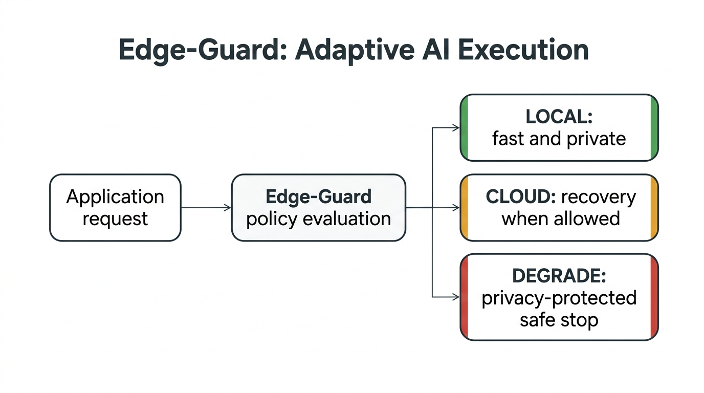
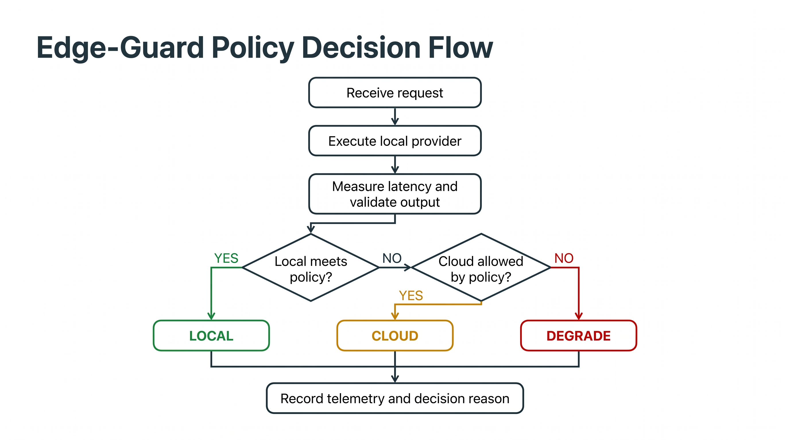
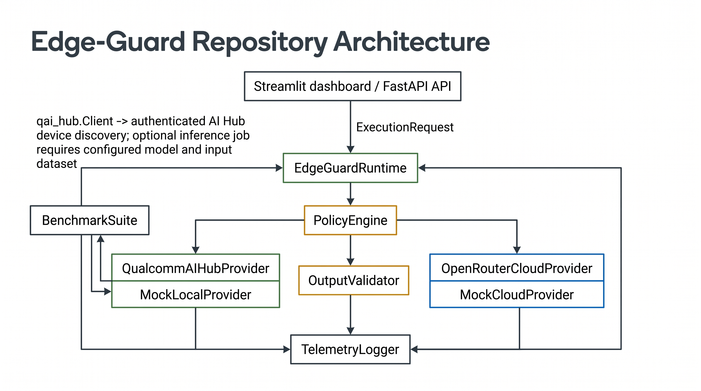

# Edge-Guard

**Adaptive Runtime & Policy Engine for Edge AI**

Edge-Guard is a policy-driven runtime layer for AI applications that want the privacy and efficiency of edge execution without blindly depending on one execution path. It evaluates runtime conditions and application requirements, then chooses **LOCAL**, **CLOUD**, or **SAFE DEGRADATION** while recording why.

## The Problem

Edge AI can reduce cloud dependency, keep sensitive data closer to the user, and support applications where network access is limited. But local execution is not always predictable: latency can vary, devices can fail, and structured output can be invalid.

Cloud AI provides a recovery option, but it introduces network dependency, provider cost, and data-egress considerations. Some requests must not leave the device.

Developers therefore need a controlled answer to three questions:

- When should a request stay on the preferred edge path?
- When may the request use cloud recovery?
- When must the system refuse cloud execution and stop safely?

## The Solution

Edge-Guard sits between an application and its AI execution providers. It attempts the preferred local path, evaluates measurable execution conditions, applies explicit policy, and returns an explainable route decision.



The current dashboard uses deterministic edge simulation so these decisions can be demonstrated repeatably. This simulation is not a claim of physical Qualcomm NPU execution.

## How It Works

1. The application sends an AI request with execution requirements.
2. Edge-Guard attempts the preferred local or edge path.
3. The runtime measures execution state and latency.
4. Structured output is validated when the policy requires it.
5. The policy engine decides whether the local result satisfies the requirements.
6. If local execution violates policy and cloud recovery is allowed, the request is routed to cloud.
7. If cloud use is prohibited or unavailable, Edge-Guard degrades safely and records the decision.

## Policy-Driven Execution

| Policy | What it checks | Possible response |
| --- | --- | --- |
| Latency SLA | Whether local execution stays below the configured limit | Keep local, use cloud, or degrade |
| Structured output | Whether output is valid JSON and contains required keys | Keep local, use cloud, or degrade |
| Privacy | Whether the request is allowed to leave the local boundary | Allow recovery or degrade |
| Cloud fallback | Whether cloud recovery is permitted | Use cloud or degrade |
| Execution availability | Whether the local provider succeeds | Keep local, use cloud, or degrade |

The MVP uses deterministic rules intentionally. Routing decisions should be explainable, reproducible, and easy for an application to enforce.



## Why This Matters

Without a shared runtime layer, every AI feature may need its own timeout handling, output validation, privacy checks, provider switching, and telemetry logic. Edge-Guard centralizes those decisions into a reusable execution policy instead of scattering fallback behavior throughout an application.

## Qualcomm Integration

Edge-Guard integrates with the Qualcomm AI Hub workflow as its device-side execution boundary. The current implementation verifies the `qai_hub` client authentication path and target-device discovery, using **Snapdragon 8 Elite QRD** as the default target.

The provider also contains an inference-job bridge for a compatible model and input dataset. A completed real inference job is not claimed in the current submission because those model and dataset assets are not configured. The dashboard demonstration uses deterministic Python edge simulation for reproducible policy testing.

This distinction is deliberate: AI Hub hosted-device discovery and an optional inference bridge are not the same claim as local inference on the laptop's Qualcomm NPU.

## System Architecture



The system consists of:

- **Application interfaces:** a Streamlit dashboard and an optional FastAPI API.
- **Runtime:** orchestrates provider execution, validation, policy evaluation, fallback, and degradation.
- **Policy engine:** evaluates latency, execution success, privacy, fallback permission, and schema results.
- **Provider layer:** supports deterministic edge simulation, Qualcomm AI Hub integration, live OpenRouter fallback, and offline mock providers.
- **Validation:** checks JSON structure and required output keys.
- **Telemetry:** records structured in-memory decision events.
- **Benchmarking:** compares local-only, cloud-only, and adaptive execution using deterministic mock providers.

## What We Built

- Deterministic policy-driven execution routing
- Latency SLA evaluation
- Structured-output and required-key validation
- Local and edge provider abstraction
- Qualcomm AI Hub integration boundary
- Cloud fallback provider
- Privacy-constrained safe degradation
- Structured decision telemetry
- Streamlit observability dashboard
- FastAPI runtime interface
- Controlled benchmark comparison

## Evaluation

The benchmark compares the same controlled workload through:

- **LOCAL_ONLY:** deterministic local provider only
- **CLOUD_ONLY:** deterministic cloud mock only
- **EDGE_GUARD:** deterministic local provider with cloud mock recovery

The current benchmark produces:

- total request count
- local, cloud, and degraded route counts
- P50 latency
- P95 latency
- average latency
- success rate

The benchmark is generated at runtime and is not stored as a result artifact in the repository. Final values should be captured from the final run used for a presentation. The current implementation uses deterministic mock providers and controlled latency/failure patterns; results are not Qualcomm hardware measurements, live OpenRouter measurements, or universal performance claims.

## Demonstration Concept

### Normal Edge Execution

The local result satisfies the configured latency and output policies.

**Result:** `LOCAL`

### Reliability Recovery

The local result violates a latency, execution, or structured-output policy. If cloud fallback is permitted, Edge-Guard attempts recovery.

**Result:** `CLOUD`

### Privacy-Constrained Failure

The local result fails, but privacy or fallback policy prohibits cloud transmission.

**Result:** `DEGRADE`

Together, these scenarios demonstrate the central value: local execution is preferred, cloud recovery is conditional, and privacy rules can force a safe stop.

## Results and Evidence

The repository provides a reproducible benchmark framework and six passing policy scenarios covering local success, latency fallback, schema fallback, privacy blocking, local failure recovery, and missing-cloud degradation.

Benchmark evidence is workload- and environment-specific. It should be interpreted as controlled routing evidence, not as universal hardware performance.

## Technology Stack

| Layer | Technology | Purpose |
| --- | --- | --- |
| Runtime | Python | Execution orchestration and provider contracts |
| Policy and validation | Pydantic-backed Python models | Structured policies, responses, and validation results |
| Dashboard | Streamlit | Interactive playground, decision log, and benchmark view |
| API | FastAPI and Uvicorn | Optional HTTP runtime interface |
| Qualcomm integration | Qualcomm AI Hub / `qai_hub` | Authentication, device discovery, and optional inference-job boundary |
| Cloud provider | OpenRouter | Configurable live fallback provider |
| Telemetry | In-memory structured logger | Decision events and summary metrics |
| Benchmarking | Deterministic mock providers | Controlled local, cloud, and adaptive comparison |

## Quick Start

Clone the repository, install the requirements, and start the dashboard:

```powershell
git clone https://github.com/aounraza379/edge-guard-hackathon.git
cd edge-guard-hackathon
python -m venv .venv
.\.venv\Scripts\Activate.ps1
python -m pip install -r requirements.txt
python -m streamlit run dashboard/app.py --server.port 8501
```

Open `http://localhost:8501`. The deterministic dashboard simulation and offline benchmark do not require API keys. Live cloud recovery requires an OpenRouter credential configured through the deployment environment. Qualcomm inference requires separately configured compatible model and input-dataset assets.

The optional API can be started with:

```powershell
uvicorn main:app --reload --port 8000
```

## Project Links

- [GitHub repository](https://github.com/aounraza379/edge-guard-hackathon)
- Live demo: to be added after deployment
- Demo video: to be added
- Presentation: to be added

## Project Status

Edge-Guard currently provides a working policy-driven runtime, deterministic edge simulation, conditional cloud fallback and degradation paths, structured in-memory telemetry, controlled benchmark comparison, dashboard visualization, an optional API, and Qualcomm AI Hub authentication/device-discovery integration. Real Qualcomm model inference depends on a compatible configured model and input dataset.

## Limitations

- The current dashboard edge path is deterministic Python simulation, not verified local Qualcomm NPU inference.
- The Qualcomm inference bridge requires compatible model and input-dataset assets that are not currently configured.
- Benchmark results use deterministic mock providers and are environment-specific.
- Live cloud recovery depends on provider availability, network access, and deployment configuration.
- Telemetry is currently held in memory and is not a persistent observability store.
